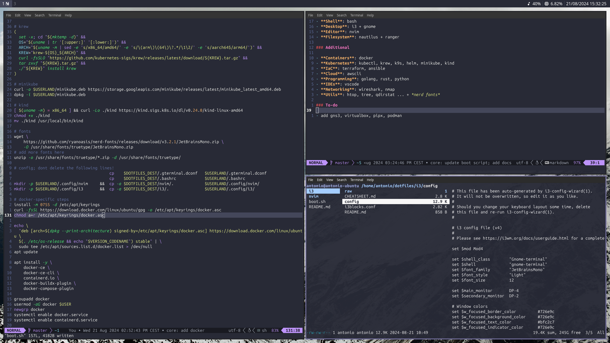

# dotfiles



The following script allows for a quick installation of a bunch of software that I typically use. Fill in the `<username>` variable at the end.

```bash
curl -s https://raw.githubusercontent.com/antoniogrv/dotfiles/master/boot.sh | sudo bash -s <username>
```

#### Notes

- Chances are you'll need to [setup SSH key pairs for version control](https://docs.github.com/en/authentication/connecting-to-github-with-ssh/generating-a-new-ssh-key-and-adding-it-to-the-ssh-agent), and then run some `git config` commands.
- `python3`, as well as `pip`, are both in *PATH*. The setup includes `go` and `rustup` too.
- If you want to tune up the `.dotfiles` directory, run `sudo chown -hR antonio:antonio .dotfiles` and swap the `origin` remote from HTTPS to SSH [as described here](https://docs.github.com/en/get-started/getting-started-with-git/managing-remote-repositories#changing-a-remote-repositorys-url).

#### Cheatsheets

- [nvim cheatsheet](https://github.com/antoniogrv/nvim-config/blob/master/CHEATSHEET.md)
- [i3 cheatsheet](https://github.com/antoniogrv/i3-config/blob/master/CHEATSHEET.md)

### Core

- **Terminal**: gnome-terminal
- **Shell**: bash
- **Desktop**: i3 + gnome
- **Editor**: nvim
- **Filesystem**: nautilus + ranger

### Additional

- **Containers**: docker
- **Kubernetes**: kubectl, krew, k9s, helm, minikube, kind
- **IaC**: terraform, ansible
- **Cloud**: awscli
- **Programming**: golang, rust, python
- **IDEs**: vscode
- **Networking**: wireshark, nmap
- **Utils**: htop, tree, qdirstat ... + *nerd fonts*

## Frequent problems

- If the GNOME Terminal profile hasn't set up properly, run the following:

```bash
dconf load /org/gnome/terminal/legacy/profiles:/:b1dcc9dd-5262-4d8d-a863-c897e6d979b9/ < /home/<username>/.gterminal.dconf
```

- If the current user doesn't get added to the `docker` group automatically, run the following:

```bash
sudo usermod -aG docker $USER && newgrp docker
```

## To-do

- add gns3, virtualbox, pipx, podman
- switch to a better terminal emulator
